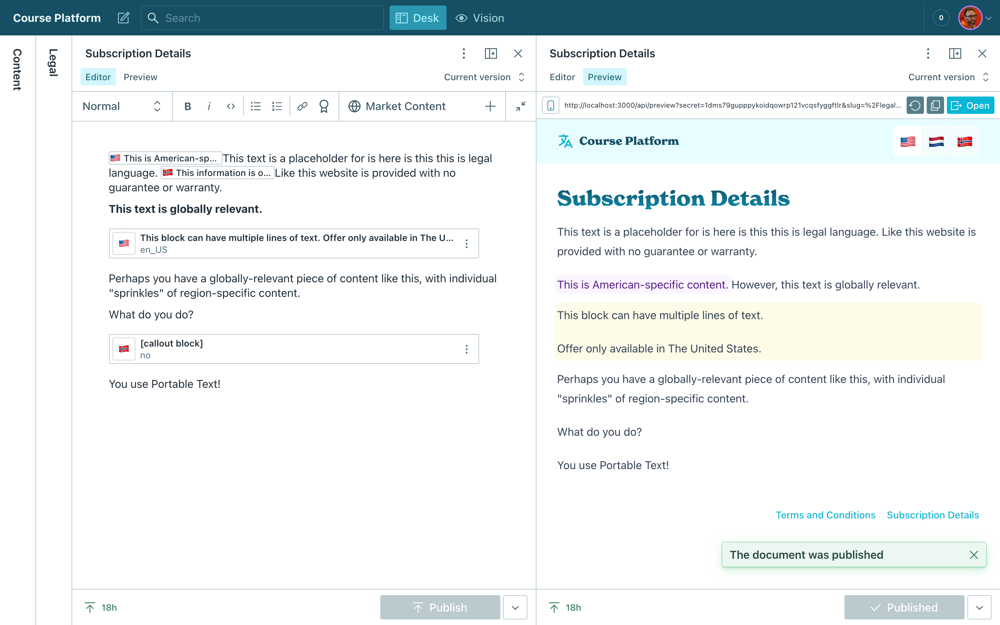
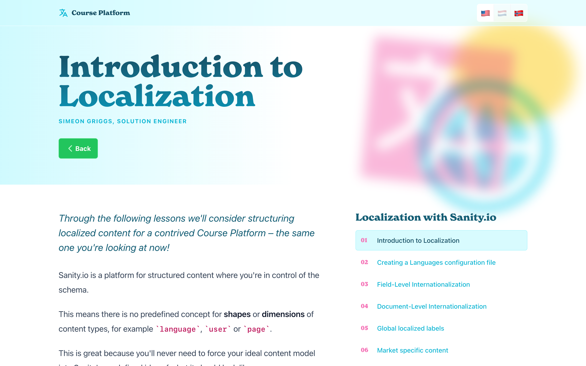

# "Course Platform" Demo

Sanity Studio and Next.js 13 front-end demonstrating multiple strategies for Localization with Sanity

Read more about [Localization with Sanity in the docs](https://www.sanity.io/docs/localization).

## Video Walkthrough

➡️ [Watch a 4 minute Studio walkthrough on YouTube](https://www.youtube.com/watch?v=6acLvAvvG2w)

## Schema

Each schema contains a unique strategy:

### Lessons

Document-level internationalization using the [@sanity/document-internationalization](https://www.npmjs.com/package/@sanity/document-internationalization) plugin. The documents in this schema are all text and use Portable Text so it is best to translate the entire document – not just the fields within them.

### Courses

Field-level internationalization of `object` fields, using the [@sanity/language-filter](https://www.npmjs.com/package/@sanity/language-filter) plugin. Only some fields in this schema require localization so we have a mix of localized objects (`title` and `slug`) as well as global fields.

This document type also uses the [Transifex Plugin](https://www.sanity.io/plugins/sanity-plugin-transifex) to create translations for the `title` and `slug` fields.

### Presenters

Field-level internationalization of `array` fields using [sanity-plugin-internationalized-array](https://www.npmjs.com/package/sanity-plugin-internationalized-array). Again only some fields are localized and some are global. This plugin may be more beneficial if you have more than four languages to save on the number of unique attributes in a dataset.

### Label Group

A singleton document with an array of key-value pairs. Useful for globally translated content for example buttons and labels. This uses the [Google Translate](https://www.sanity.io/plugins/sanity-plugin-google-translate) plugin which can automatically translate from the base language field directly in the Studio.

### Legal

A demonstration of writing multiple languages or market-specific content within a single document and filtering the content at the time of the query. Allows authors to create personalized content for markets without handling multiple fields or documents.
